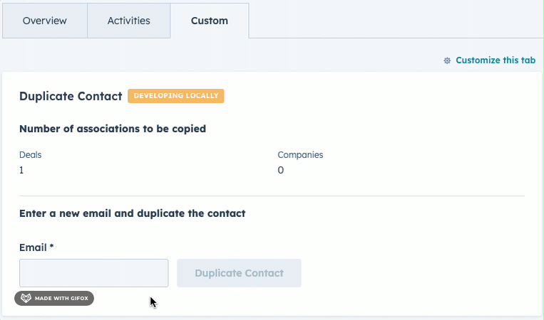

# Contact Duplicate Extension

The Contact Duplicate extension allows a HubSpot user to duplicate one of their contacts, its deal & company associations, and some of its contact properties.

This extension demonstrates a number of interactions that are enabled by React extensions.

- async fetching with HubSpot serverless functions
- loading and error states
- GraphQL calls inside serverless functions

## Getting started

1. Update your CLI to the latest version using `npm -g @hubspot/cli@next`
2. Create a new project with `hs project create --templateSource="HubSpot/ui-extensions-react-examples"`

> The UI extensions with React are currently available only with private beta. To request access for the beta as well as relavant documentation, fill out this [form](https://forms.gle/WLfKffhoe1j5z2WRA).
