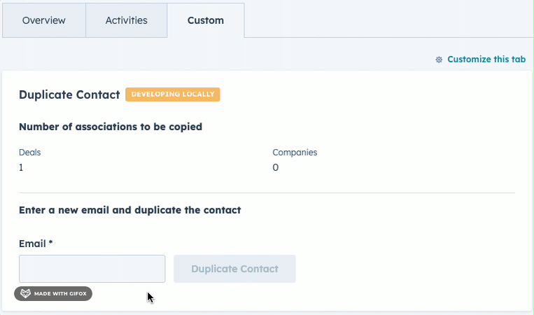

# Duplicate a contact sample 

The Duplicate a contact sample allows a HubSpot user to duplicate one of their contacts, its deal & company associations, and some of its contact properties.

This extension demonstrates a number of interactions that are enabled by React extensions.

- async fetching with HubSpot serverless functions
- loading and error states
- GraphQL calls inside serverless functions

## Quick Start

### Step 1: Update your CLI and & authenticate your account

1. Update to latest CLI version by running `npm install -g @hubspot/cli@latest`.
1. Run `hs init` if you haven’t already done so to create a config file for your parent account.
1. Run `hs auth` to authenticate your account. Alternatively, select your pre-authenticated account with `hs accounts use`.

### Step 2: Create the project

In the folder where you want this sample to be cloned, create a new project by running `hs project create --templateSource="HubSpot/ui-extensions-examples" --dest="duplicate-contact" --name="duplicate-contact" --template="duplicate-contact"`

### Step 3: Install dependencies

Now in the CLI, enter into this newly created folder by `cd duplicate-contact`. You will need to run `npm install` in both the `/src/app/extensions` and `/src/app/app.functions` directories to install the dependencies for this project.

### Step 4: Upload project

Run `hs project upload`. If you’d like to build on this project, run `hs project dev` to kickoff the dev process and see changes reflected locally as you build.

### Step 5: View the cards

In the main menu select `Contacts` > `Contacts` to view contact records. Click on any of the contact objects and navigate to the custom tab to access the sample card. If you don’t have any contacts in the account you’re using to view this sample, create a contact by the following steps:

1. In the main menu, select `Contacts` > `Contacts`.
2. Click `Create contact` in the top right hand corner and fill in all required fields. Click `create` once you’ve finished filling in your contact details.
3. Your new contact should appear in the `Contacts table`. Select it and navigate to the `Custom` tab in the middle pane to access the sample card.

If you haven't customized the tabs before follow step #4 from [this guide](https://developers.hubspot.com/docs/platform/ui-extensions-quickstart).

> The UI extensions with React are currently available only with private beta. To request access for the beta as well as relavant documentation, fill out this [form](https://forms.gle/WLfKffhoe1j5z2WRA).
