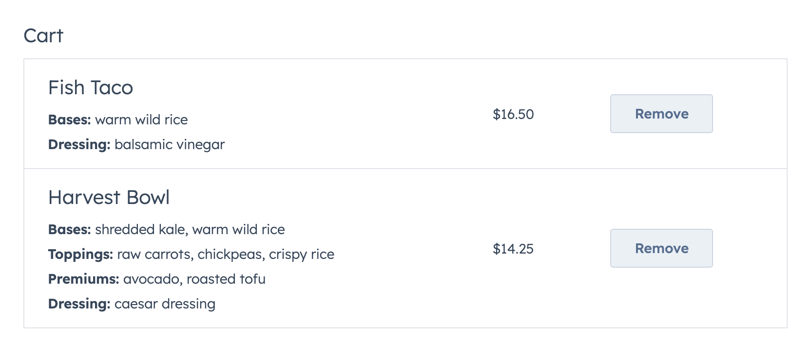

# Gift A Meal extension

The Gift A Meal extension allows a HubSpot user to send a meal from a local restaurant to one of their contacts.

This extension demonstrates a number of interactions that are enabled by React extensions.

- realtime form validation
- table pagination and search
- async fetching with HubSpot serverless functions
- loading, error, and empty states
- getting current contact properties
- getting current user properties
- triggering alerts in the CRM outside extension boundaries

## Key Components

### [OrderMealCard.tsx](src/app/extensions/components/OrderMealCard.tsx)

The top level component that manages the extension. It fetches the restaurants and CRM info on extension load, keeps track of the cart, and issues success alerts to the host app.

### [RestaurantsSearch.tsx](src/app/extensions/components/RestaurantsSearch.tsx)

A paginated, searchable table of restaurants.

### [RestaurantMenu.tsx](src/app/extensions/components/RestaurantMenu.tsx)

A list of menu items with item summaries and a button to go into more detail.

### [MenuItemRow.tsx](src/app/extensions/components/MenuItemRow.tsx)

An individual menu item table row that shows the name of the item, a description, and the price, with a button to view the item details.

### [MenuItemDetails.tsx](src/app/extensions/components/MenuItemDetails.tsx)

The details of a single menu item where the user can choose customizations for the paricular menu item. Features validation that will show errors and disable the "Add" button to prevent an item from being added to the cart until all requirements are met.

### [Cart.tsx](src/app/extensions/components/Cart.tsx)

All the items that have been added to the cart, or else an empty state encouraging the user.

### [CartItemRow.tsx](src/app/extensions/components/CartItemRow.tsx)

An individual item in the cart showing the menu item, any addons that were added, the price, and a remove button to remove it from the cart.

### [Checkout.tsx](src/app/extensions/components/Checkout.tsx)

A calculation of the cart subtotal, any shipping costs, and the final total. Includes a text box for leaving a message for the contact as well as some validation and encouraging text not to leave the message blank.

