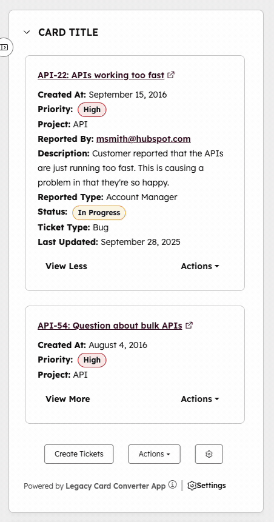

# Legacy CRM Card to UI Extension Converter

> A example card to help migrate legacy CRM cards to modern UI extension cards on HubSpot's developer platform.

This Legacy CRM Card Converter provides a [UI extension card](https://developers.hubspot.com/docs/apps/developer-platform/add-features/ui-extensibility/app-cards/overview) that works just like legacy CRM cards, offering an easy migration path as [legacy CRM cards are being deprecated](https://developers.hubspot.com/docs/api-reference/crm-public-app-crm-cards-v3/guide). This example allows you to test and develop your new card before fully migrating it to your production app. The converter fetches data from a configurable API endpoint and displays it using HubSpot's UI Extensions framework with tiles, expandable content, and action buttons.



## Table of Contents

  - [Prerequisites](#prerequisites)
  - [Getting started](#getting-started)
  - [Development Tools](#development-tools)
  - [Adding the card to your production app](#adding-the-card-to-your-production-app)
  - [Differences from legacy CRM cards](#differences-from-legacy-crm-cards)
  - [Project structure](#project-structure)
  - [Next steps](#next-steps)
  - [Additional resources](#additional-resources)
  - [Support](#support)


## Prerequisites

Before you begin, ensure you have:

* Installed the latest version of the [HubSpot CLI](https://developers.hubspot.com/docs/developer-tooling/local-development/hubspot-cli/install-the-cli) (version `7.9.0` or later)
* An existing [Legacy Crm Card](https://developers.hubspot.com/docs/api-reference/crm-public-app-crm-cards-v3/guide) that you want to migrate
* [Migrated the app with the Legacy Crm Card to the projects platform](https://developers.hubspot.com/docs/apps/developer-platform/build-apps/migrate-an-app/migrate-an-existing-public-app).

## Getting started

### Step 1: Clone the repository

Clone this repository to your local machine:

```shell
git clone git@github.com:HubSpot/ui-extensions-examples.git
cd ui-extensions-examples/legacy-card-converter/
```

### Step 2: Get your legacy CRM card definition

Retrieve the definition for your legacy CRM card using the [Get a card API endpoint](https://developers.hubspot.com/docs/api-reference/crm-public-app-crm-cards-v3/cards/get-crm-v3-extensions-cards-dev-appId-cardId):

```shell
curl --request GET \
  --url 'https://api.hubapi.com/crm/v3/extensions/cards-dev/{appId}/{cardId}?hapikey={developerAPIKey}'
```

Replace `{appId}` with your app ID and `{cardId}` with your card ID. You can also call the [Get all Cards API endpoint](https://developers.hubspot.com/docs/api-reference/crm-public-app-crm-cards-v3/cards/get-crm-v3-extensions-cards-dev-appId) to get the cardId and the definition for all legacy CRM Card on the app.

### Step 3: Configure the card definition

1. Copy the JSON response from the GET endpoint.
2. Paste it into `src/app/cards/definition/DEFINITION.json`, replacing the existing example content.

The definition should include:
* `title`: The card title
* `fetch.targetUrl`: The URL your card will fetch data from
* `fetch.objectTypes`: Array of CRM object types the card supports, with properties to include.
* `display.properties`: Array of properties to display on the card
* `actions.baseUrls`: Array of base URLs for card actions

### Step 4: Configure permitted URLs

Add your card's fetch target URL and action base URLs to the app's permitted URLs configuration:

1. Open `src/app/app-hsmeta.json`
2. Locate the `permittedUrls` section
3. Add your `fetch.targetUrl` from the definition to the `fetch` array
4. Add all `actions.baseUrls` from the definition to the `fetch` array as well:

```json
"permittedUrls": {
  "fetch": [
    "https://your-api-endpoint.com",
    "https://your-action-base-url.com"
  ],
  "iframe": [],
  "img": []
}
```

Learn more about [configuring permitted URLs](https://developers.hubspot.com/docs/apps/developer-platform/build-apps/app-configuration#permittedurls) in the app configuration documentation.

### Step 5: Configure object types

Update the card's supported object types:

1. Open `src/app/cards/LegacyCardConverter-hsmeta.json`
2. Update the `objectTypes` array to match the object types your legacy CRM card supported
3. Remove any unnecessary object types

The available object types for Legacy Crm Cards are:
* `contacts`
* `companies`
* `deals`
* `tickets`

Example:

```json
"objectTypes": [
  "contacts",
  "companies"
]
```

Reference the [documentation](https://developers.hubspot.com/docs/apps/developer-platform/add-features/ui-extensibility/app-cards/reference#supported-objects) for the full list of supported object types for UI Extensions, as they support more than Legacy CRM Cards.

### Step 6: Configure helpdesk card (if supporting tickets)

**If your legacy CRM card supports tickets**, you'll need to configure a separate helpdesk card so customers can view the card in the helpdesk workspace. This project includes an example helpdesk card configuration file. **Otherwise, you can delete this config file.**

1. Open `src/app/cards/LegacyCardConverter-Helpdesk-hsmeta.json`
2. Update the `name` field to match your app name (replace `CARD TITLE`):

```json
{
  "uid": "legacy-card-converter-card-helpdesk",
  "type": "card",
  "config": {
    "name": "CARD TITLE - Helpdesk",
    "location": "helpdesk.sidebar",
    "entrypoint": "/app/cards/Converter.tsx",
    "objectTypes": [
      "tickets"
    ]
  }
}
```

The helpdesk card uses the same `Converter.tsx` component as the CRM card, but is configured to appear in the `helpdesk.sidebar` location. Learn more about [extension locations](https://developers.hubspot.com/docs/apps/legacy-apps/private-apps/build-with-projects/create-ui-extensions#extension-location) in the UI extensions documentation.

### Step 7: Update the card title

1. Open `src/app/cards/LegacyCardConverter-hsmeta.json`
2. Replace `CARD TITLE` in the `name` field with your app's name:

```json
"name": "Your App Name"
```

### Step 8: Update your backend API

If you have `POST`, `PUT`, or `PATCH` Action Hooks that rely upon the properties sent in the body of the request, you must update your backend API to accept action request parameters in **either** format:

* **Query parameters**: Parameters are sent as URL query parameters, e.g., `?userId=123&userEmail=user@example.com&associatedObjectId=456&associatedObjectType=CONTACT&portalId=789&additionalProperty=example`
* **JSON body**: Parameters are sent as a JSON object in the request body, e.g., `{"userId": "123", "userEmail": "user@example.com", "associatedObjectId": "456", "associatedObjectType": "CONTACT", "portalId": "789", "additionalProperty": "example"}`

Legacy CRM cards sent POST, PUT, and PATCH requests as `application/x-www-form-urlencoded`, e.g. `userId=123&userEmail=user@example.com&associatedObjectId=456&associatedObjectType=CONTACT&portalId=789&additionalProperty=example`. but HubSpot's `hubspot.fetch` API only supports JSON bodies for these request methods. Your backend should handle either query parameters and JSON body formats alonside the `application/x-www-form-urlencoded` body format for backwards compatibility.

### Step 9: Test your card

1. Install project dependencies:

```shell
hs project install-deps
```

2. Upload the project to HubSpot:

```shell
hs project upload
```

3. Install and configure the card in a test account:
   * Navigate to **Development** > **Projects** in your HubSpot account
   * Click on your project name
   * Install the app in a test account
   * Navigate to a CRM record (contact, company, deal, or ticket) that matches your configured object types
   * Add the card to the record page using the page editor

4. Test the card functionality to ensure it behaves similarly to your existing legacy CRM card, including testing action requests to verify your backend API handles the new JSON body format.

For more information on testing and viewing app cards, see the [Create an app card](https://developers.hubspot.com/docs/apps/developer-platform/add-features/ui-extensibility/app-cards/create-an-app-card) documentation.

## Development Tools

This project includes ESLint, Prettier, Husky, Vitest, and TypeScript for code quality, testing, and type safety.

### Available Commands

Run these commands from the `src/app/cards/` directory:

```shell
# Run tests
npm run test

# Run tests in watch mode
npm run test:watch

# Check for TypeScript types issues
npm run typecheck

# Lint code (check for issues)
npm run lint

# Lint and auto-fix issues
npm run lint:fix

# Format code with Prettier
npm run format

# Check if code is formatted correctly
npm run format:check
```

### Pre-commit Hooks

Husky is configured to automatically lint and format staged files before commits. The pre-commit hook will:

- Run ESLint with auto-fix on TypeScript/JavaScript files
- Format code with Prettier
- Prevent commits if there are unfixable linting errors

## Adding the card to your production app

Once you're satisfied with how the card behaves, you can add it to your production app:

### Step 1: Ensure your app is migrated

Your app must be migrated to the latest projects platform version (`2025.2`). Check your `hsproject.json` file to confirm:

```json
{
  "platformVersion": "2025.2"
}
```

If your app hasn't been migrated yet, follow the [migration guide](https://developers.hubspot.com/docs/apps/developer-platform/build-apps/migrate-an-app/migrate-an-existing-public-app).

### Step 2: Copy the cards folder

Copy the entire `src/app/cards/` directory from this project into your app's `src/app/` directory.

### Step 3: Update app configuration

Ensure your app's `app-hsmeta.json` file includes:
* The correct `permittedUrls` with your fetch target URL and all action base URLs (action hooks also require `fetch` permission).
* The necessary OAuth scopes for the object types your card supports

For example, if your card supports contacts, ensure you have:

```json
"requiredScopes": [
  "crm.objects.contacts.read"
]
```

### Step 4: Use feature flags for gradual rollout

If your app is listed on the [HubSpot Marketplace](https://ecosystem.hubspot.com/marketplace/apps), on migration your app will automatically use the [feature flags API](https://developers.hubspot.com/docs/api-reference/crm-public-app-feature-flags-v3-v3/guide) to control card visibility:

* Use the `hs-release-app-cards` flag to gradually roll out your new cards to specific accounts
* Use the `hs-hide-crm-cards` flag to hide legacy CRM cards from accounts that have been migrated

This allows you to test the new cards with a subset of users before making them available to everyone.

**Feature flags apply to all cards in your app.** You cannot selectively release or hide individual cards within an app using feature flags. If you have more than one Legacy CRM Card, make sure to include replacements for all of them in your app.

## Differences from legacy CRM cards

While this converter card is designed to work similarly to legacy CRM cards, there are some differences you should be aware of:

### Action request body format

* **Legacy cards**: POST, PUT, and PATCH action requests send data as `application/x-www-form-urlencoded` (URL-encoded text body)
* **UI Extension Converter**: POST, PUT, and PATCH action requests send data as JSON in the request body. GET and DELETE requests continue to use query parameters.

**Important**: You will need to update your backend API to accept action request parameters in **either** format:
* Query parameters
* JSON body

This is because HubSpot's `hubspot.fetch` API only supports sending JSON bodies for POST, PUT, and PATCH requests, and does not support custom Content-Type headers.

### Card title

* **Legacy cards**: The card title is updated dynamically to show the number of objects returned (e.g., "Issues (5)")
* **UI Extension Converter**: The card title cannot be updated dynamically. The title is configured statically in the `hsmeta` file and cannot be changed by the React code at runtime.

You may choose to display this information within the card content instead, such as in a header or summary section. This example code does not include that by default.

### Settings action

* **Legacy cards**: Settings actions appear in the card footer
* **UI Extension Converter**: Settings actions are rendered as a button with a settings gear icon. Consider creating a [UI extension settings page](https://developers.hubspot.com/docs/apps/developer-platform/add-features/ui-extensibility/create-a-settings-component) instead of using the settings action iframe. This provides a better user experience and follows HubSpot's recommended patterns.

### Padding differences

There are slight padding differences between legacy CRM cards and UI extension cards. The converter card attempts to match the legacy card appearance as closely as possible, but some minor visual differences may exist.

### App ID query parameter

* **Legacy cards**: The `appId` query parameter is not included in data fetch requests or action hooks
* **UI Extension Converter**: The `appId` query parameter is automatically included in all data fetch requests and action hooks

**Important**: Your backend API should be prepared to handle the `appId` query parameter in both data fetch requests and action hooks. This parameter identifies which HubSpot app is making the request.

### Otherwise identical

This card should render the same data, use the same fetch endpoint, and support the same actions as your legacy CRM card.

## Project structure

```
LegacyCardConverter/
├── hsproject.json                 # Project configuration
└── src/
    └── app/
        ├── app-hsmeta.json        # App configuration
        └── cards/
            ├── Converter.tsx      # Entry point, registers the extension
            ├── LegacyCardConverter-hsmeta.json  # CRM card configuration
            ├── LegacyCardConverter-Helpdesk-hsmeta.json  # Helpdesk card config (delete if not supporting tickets)
            ├── package.json       # Card dependencies
            ├── components/        # React components
            │   ├── LegacyCardContent.tsx  # Main content renderer
            │   ├── ObjectTile.tsx         # Individual object display
            │   ├── ActionButton.tsx       # Action button component
            │   ├── ActionsDropdown.tsx    # Dropdown for multiple actions
            │   ├── ConfirmationModal.tsx  # Confirmation dialog
            │   ├── ValidationErrorUI.tsx  # Error display
            │   └── Properties/            # Property value renderers
            ├── contexts/          # React contexts
            │   └── CardLocationContext.tsx  # Extension location context
            ├── definition/        # Card definition handling
            │   ├── DEFINITION.json   # Legacy card definition (paste your card here)
            │   ├── CardConfig.ts     # Configuration parser
            │   └── validateDefinition.ts  # Definition validation
            ├── hooks/             # Custom React hooks
            │   └── useFetchLegacyCardData.ts  # Data fetching hook
            ├── types/             # TypeScript type definitions
            │   ├── definition/    # Types for card definition
            │   └── response/      # Types for API responses
            └── utils/             # Utility functions
                ├── fetchFromTargetUrl.ts   # API fetching
                ├── handleActionOnClick.ts  # Action handlers
                └── queryParams.ts          # Query parameter helpers
```

## Next steps

* Learn more about [creating app cards](https://developers.hubspot.com/docs/apps/developer-platform/add-features/ui-extensibility/app-cards/create-an-app-card) on the new developer platform
* Review the [app card reference documentation](https://developers.hubspot.com/docs/apps/developer-platform/add-features/ui-extensibility/app-cards/reference) for configuration options
* Explore [UI extension components](https://developers.hubspot.com/docs/apps/developer-platform/add-features/ui-extensibility/ui-components/overview) to customize your card further
* Create a [settings page](https://developers.hubspot.com/docs/apps/developer-platform/add-features/ui-extensibility/create-a-settings-component) for your app
* Consult the [app configuration](https://developers.hubspot.com/docs/apps/developer-platform/build-apps/app-configuration) reference for project structure details

## Additional resources

* [Migrate an existing public app](https://developers.hubspot.com/docs/apps/developer-platform/build-apps/migrate-an-app/migrate-an-existing-public-app)
* [Feature flags API guide](https://developers.hubspot.com/docs/api-reference/crm-public-app-feature-flags-v3-v3/guide)
* [Legacy CRM cards documentation](https://developers.hubspot.com/docs/api-reference/crm-public-app-crm-cards-v3/guide)
* [Fetching data for UI extensions](https://developers.hubspot.com/docs/apps/developer-platform/add-features/ui-extensibility/fetching-data)
* [HubSpot CLI project commands](https://developers.hubspot.com/docs/developer-tooling/local-development/hubspot-cli/project-commands)

## Support

If you encounter issues or have questions:

1. Check the [HubSpot Developer Documentation](https://developers.hubspot.com/docs)
2. Review the [migration guide](https://developers.hubspot.com/docs/apps/developer-platform/build-apps/migrate-an-app/migrate-an-existing-public-app)
3. Join the [HubSpot Developer Community](https://community.hubspot.com/t5/HubSpot-Developers/ct-p/developers)
