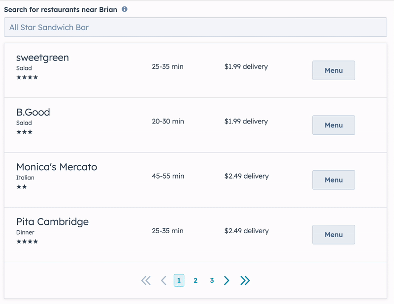
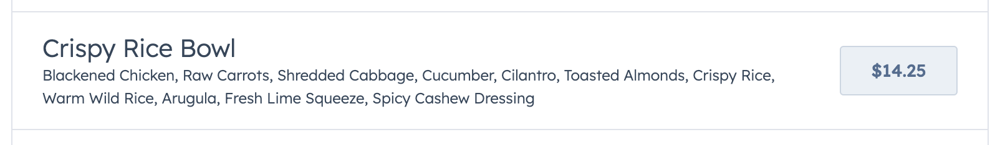
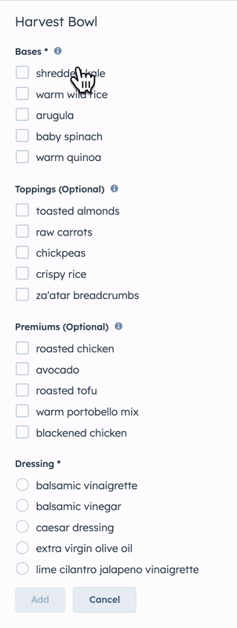
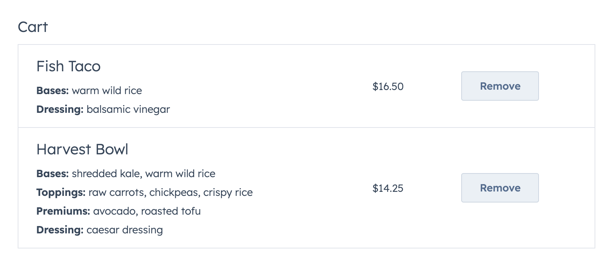
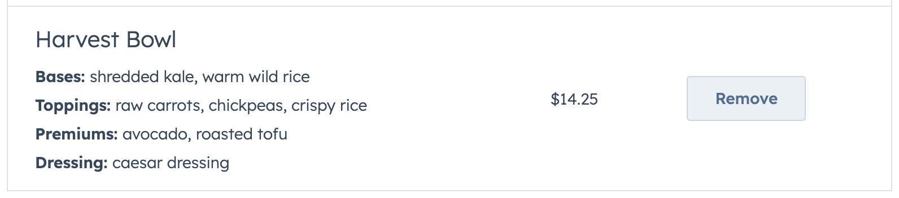
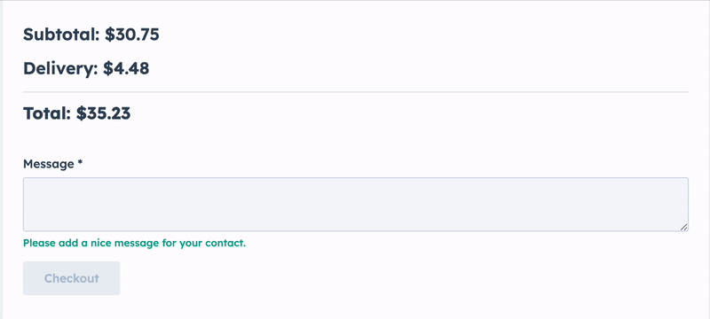

# Build a multi-step flow sample 

The Build a multi-step flow sample allows a HubSpot user to send a meal from a local restaurant to one of their contacts.

This sample demonstrates a number of interactions that are enabled by React extensions.

- realtime form validation
- a form in a Panel
- table pagination and search
- async fetching with HubSpot serverless functions
- loading, error, and empty states
- getting current contact properties
- getting current user properties
- triggering alerts in the CRM outside extension boundaries

## Quick Start

### Step 1: Update your CLI and & authenticate your account

1. Update to latest CLI version by running `npm install -g @hubspot/cli@latest`.
1. Run `hs init` if you haven’t already done so to create a config file for your parent account.
1. Run `hs auth` to authenticate your account. Alternatively, select your pre-authenticated account with `hs accounts use`.

### Step 2: Create the project

In the folder where you want this sample to be cloned, create a new project by running `hs project create --templateSource="HubSpot/ui-extensions-examples" --location="multi-step-flow" --name="multi-step-flow" --template="multi-step-flow"`

### Step 3: Install dependencies

Now in the CLI, enter into this newly created folder by `cd multi-step-flow`. Run `npm install` to install the dependencies for this project.

### Step 4: Upload project

Run `hs project upload`. If you’d like to build on this project, run `hs project dev` to kickoff the dev process and see changes reflected locally as you build.

### Step 5: View the cards

In the main menu select `Contacts` > `Contacts` to view contact records. Click on any of the contact objects and navigate to the custom tab to access the sample card. If you don’t have any contacts in the account you’re using to view this sample, create a contact by the following steps:

1. In the main menu, select `Contacts` > `Contacts`.
2. Click `Create contact` in the top right hand corner and fill in all required fields. Click `create` once you’ve finished filling in your contact details.
3. Your new contact should appear in the `Contacts table`. Select it and navigate to the `Custom` tab in the middle pane to access the sample card.

If you haven't customized the tabs before follow step #4 from [this guide](https://developers.hubspot.com/docs/platform/ui-extensions-quickstart).

## Key Components

### [OrderMealCard.tsx](src/app/extensions/components/OrderMealCard.tsx)

The top level component that manages the extension. It fetches the restaurants and CRM info on extension load, keeps track of the cart, and issues success alerts to the host app.

### [RestaurantsSearch.tsx](src/app/extensions/components/RestaurantsSearch.tsx)

A paginated, searchable table of restaurants.

### [RestaurantMenu.tsx](src/app/extensions/components/RestaurantMenu.tsx)

A list of menu items with item summaries and a button to go into more detail.

### [MenuItemRow.tsx](src/app/extensions/components/MenuItemRow.tsx)

An individual menu item table row that shows the name of the item, a description, and the price, with a button to view the item details.

### [MenuItemDetails.tsx](src/app/extensions/components/MenuItemDetails.tsx)

The details of a single menu item where the user can choose customizations for the paricular menu item. Features validation that will show errors and disable the "Add" button to prevent an item from being added to the cart until all requirements are met.

### [Cart.tsx](src/app/extensions/components/Cart.tsx)

All the items that have been added to the cart, or else an empty state encouraging the user.

### [CartItemRow.tsx](src/app/extensions/components/CartItemRow.tsx)

An individual item in the cart showing the menu item, any addons that were added, the price, and a remove button to remove it from the cart.

### [Checkout.tsx](src/app/extensions/components/Checkout.tsx)

A calculation of the cart subtotal, any shipping costs, and the final total. Includes a text box for leaving a message for the contact as well as some validation and encouraging text not to leave the message blank.

