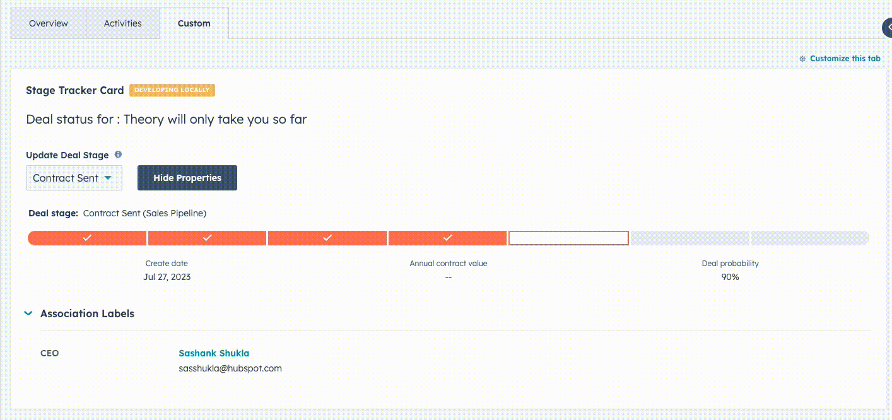

# CRM Components Extensions

This React Project demonstrates the usage of HubSpot CRM Components through UIE. The project includes 2 extensions:

1. Association Table displaying important deals associated with the current user (demonstrates pre-filters, quick filters, and property projections)
2. Stage tracker with high level properties, and property list filtered by pipeline

These extensions demonstrate a number of interactions including:

- Using HubSpot's CRM Data Components
- Using new styling/layout components available through UIE
- Making API calls to the HubSpot API using serverless functions
- Fetching properties for the current object

## Quick Start

### Step 1: Update your CLI and & authenticate your account
1. Update to latest CLI version by running `npm install -g @hubspot/cli@latest`.
2. Run `hs init` if you haven’t already done so to create a config file for your parent account.
3. Run `hs auth` to authenticate your account. Alternatively, select your pre-authenticated account with `hs accounts use`.

### Step 2: Create the project
In the folder where you want this sample to be cloned, create a new project by running  
`hs project create --templateSource="HubSpot/ui-extensions-examples"` and choosing the project from the menu.

### Step 3: Install dependencies
In the CLI, run `npm install` to install the dependencies for this project.

### Step 4: Upload project
Run `hs project upload`. If you’d like to build on this project, run `hs project dev` to kickoff the dev process and see changes reflected locally as you build.

