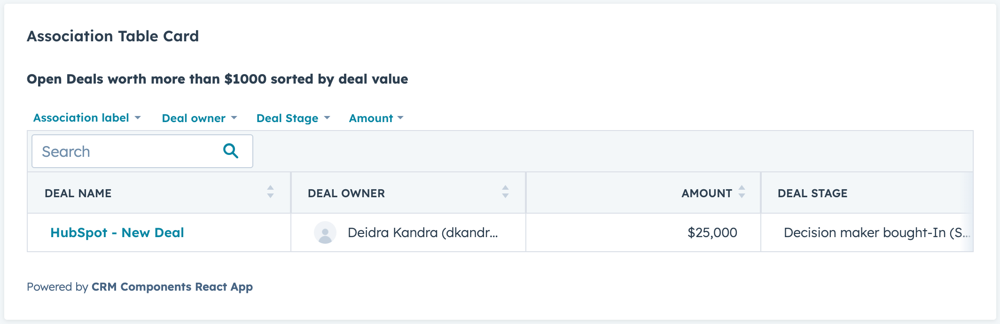

# CRM Components Extensions

This React Project demonstrates the usage of HubSpot CRM Components through UIE. The project includes 2 extensions:
1. Association Table display important deals associated with the current user (demonstates pre-filters, quick filters, and property projections)
2. Stage tracker with high level properties, and property list filtered by pipeline

These extensions demonstrate a number of interactions including:

- Using HubSpot's CRM Data Components
- Using new styling/layout components available through UIE
- Making API calls to the HubSpot API using serverless functions
- Fetching properties for the current object
- Reflect changes in UI extensions based on changes to the object in the CRM

## Getting started

1. Update your CLI to the latest version using `npm -g @hubspot/cli@next`
2. Create a new project with `hs project create --templateSource="HubSpot/ui-extensions-react-examples"`

> The UI extensions with React are currently available only with private beta. To request access for the beta as well as relavant documentation, fill out this [form](https://forms.gle/WLfKffhoe1j5z2WRA).
